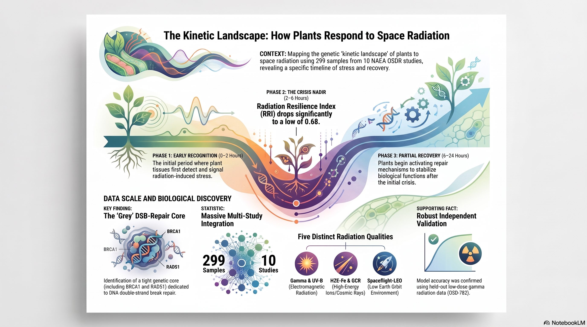

# Plant Response to Radiation

Transcriptomic analysis of how plants respond to ionizing radiation in spaceflight-relevant
environments, using NASA Open Science Data Repository (OSDR) datasets.

The repository is organised around its **current focus** — a kinetic, cross-study analysis of
the plant ionizing-radiation response — with the **earlier per-contrast analysis preserved under
[`legacy/`](legacy/)**.

---

## Current analysis — The Kinetic Landscape of Plant Ionizing-Radiation Response

A reproducible pipeline that aggregates **299 samples from 10 NASA OSDR studies** (five radiation
qualities: gamma, HZE-Fe, GCR, UV-B, spaceflight-LEO), deconvolves bulk transcriptomes into
pseudo-cell-type profiles, trains a Gaussian-Process autoencoder with continuous dose/time/LET
covariates, reconstructs inter-tissue signaling kinetics with PlantCellChat, builds kinetic WGCNA
modules, computes a composite **Radiation Resilience Index (RRI)**, and visualizes the
stress-signaling wave across plant organs with ggPlantmap.

**Key results**
- A three-phase kinetic architecture — early recognition (0–2 h), crisis nadir (2–6 h), partial
  recovery (6–24 h) — with the RRI dropping from 0.79 to 0.68 at the nadir.
- An early-response WGCNA module (blue) enriched for independently-called radiation DEGs, and a
  tight **grey DSB-repair core** (BRCA1, PARP2, RAD51, SMR7, GMI1, XRI1).
- **Independent validation** on the held-out study **OSD-782 / GLDS-679** (low-dose gamma, not in
  the training cohort): held-out response genes recover the blue module (2.3×, P = 2.8 × 10⁻¹²).

| Path | Contents |
|------|----------|
| [`code/`](code/) | Numbered pipeline scripts `01`–`15` (acquisition → modeling → validation) |
| [`data/`](data/) | Metadata, expression matrix, ortholog map, LR pairs, model checkpoint, validation inputs |
| [`results/`](results/) | Deconvolution, trajectories, CellChat, WGCNA, RRI, pathway tables, and figures |
| [`manuscript_chapter.md`](manuscript_chapter.md) | Full manuscript draft |
| [`README_pipeline.md`](README_pipeline.md) | Detailed pipeline reference + **Data Dictionary** |
| [`docs/`](docs/) | GitHub Pages landing page |

See **[`README_pipeline.md`](README_pipeline.md)** for the complete data dictionary, reproduction
guide, and methodological notes.

### Large / regenerable files

A few large derived tables (>5 MB) and the raw OSD-782 count matrix are **not tracked in git** to
keep the repository lightweight — they live in the Zenodo bundle and are regenerated by the
pipeline. See [`README_pipeline.md` § Large files (Zenodo-only)](README_pipeline.md#large-files-zenodo-only).
All other derived data are included in the repository.

---

## Legacy analysis (`legacy/`)

The earlier per-contrast analysis is preserved unchanged under [`legacy/`](legacy/): DESeq2
differential expression, WGCNA, and Metascape enrichment across several GeneLab/OSDR radiation
studies, including dedicated `sog1-1` and `MYB3R` knockout contrasts. Its DESeq2 gene calls are
reused by the current pipeline as a cross-pipeline consistency check
(`code/14_old_repo_overlap.py`); see [`legacy/README.md`](legacy/README.md) for its own
documentation.

---

## Author & license

**Author:** Richard Barker ([@dr-richard-barker](https://github.com/dr-richard-barker))
Code and data licensing terms are in [`LICENSE`](LICENSE); per-component terms (CC-BY 4.0 data,
MIT code) are noted in `README_pipeline.md`.

**Data source:** NASA Open Science Data Repository (OSDR) — https://osdr.nasa.gov
